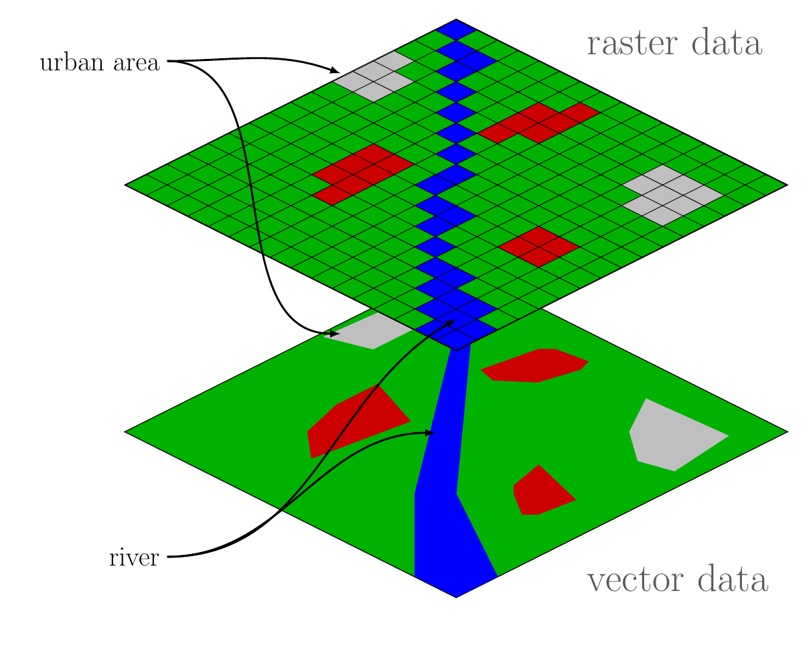

```{r setup, echo=FALSE, warning=FALSE, purl=FALSE, message=FALSE}
knitr::opts_chunk$set(echo = TRUE, cache = TRUE)
options(repos="http://cran.rstudio.com/")
pkgs <- c("sf","sp","raster","knitr","stars", "terra")
x<-lapply(pkgs, library, character.only = TRUE)
opts_chunk$set(tidy=FALSE)
```

# R for Spatial Analysis
Not too long ago, the standard advice for mixing spatial analysis and R was to do your spatial analysis tasks with a GIS and your statistical analysis of the results of that analysis with R.  However, since the mid 2000's there has been a rapid increase in the spatial data handling and analysis capability of R.  The `rgdal`, `rgeos`, `raster`, and `sp` packages (through the very significant effort of the package authors) provided the foundation for doing GIS entirely within R. More recently a new route for handling vector data has emerged in the [`sf` package](https://cran.r-project.org/package=sf).  Most current development for vector processing is focusing on `sf`.  Raster data is still mostly dealt with via the [`raster`](https://cran.r-project.org/package=raster) package, although this is changing rapidly as development on the [`terra`](https://cran.r-project.org/package=terra) and [`stars`](https://cran.r-project.org/package=stars) packages is moving along quickly.

## Basics: Vector and raster data

Before we dig into the packages, I want to do a bit of some basics just to make sure everyone is on the same page with the most common types of spatial data: vector and raster.  It is important to understand this when working with spatial data as the tooling for working with the data will be different when using vector vs raster data.  This is the case across all software and not specific to R.

Vector data is data that represents features with discrete locations and can be used to show things like points (e.g. species locations, fire hydrants), lines (e.g. roads, streams), or polygons (e.g. lakes, state boundaries).  On the other hand, raster data breaks up the world into pixels.  For each pixel we have a location and then a value for that pixel to indicated if it is a hydrant, a road, a stream, a lake, etc.  See the example below:



## Spatial software ecosystem

Before we get to the R packages we need to discuss a bit about the underlying software libraries that make all of this GIS and spatial data analysis in R possible.  The three primary pieces of software are the [Geospatial Data Abstraction Library (GDAL)](https://www.osgeo.org/projects/gdal/), [Geometry Engine - Open Source (GEOS)](https://www.osgeo.org/projects/geos/), and [PROJ](https://www.osgeo.org/projects/proj/) and are all projects of the Open Source GeoSpatial Foundation and provide Input/Ouput for many different file types, topology and spatial operations, and coordinate tranformation functionality, respecitvely.  These are the libraries that provide much of the funtionality for many open source GIS and spatial analysis software.

In R, these three software libraries are accessed and made available via several packages.  The primary ones are discussed below.  

### sf
The [`sf` package](http://r-spatial.github.io/sf/) provides vector data handling via the Simple Features standard, an Open Geospatial Consortium and International Standards Organization standard for spatial data. In addition, `sf` provides a tidy spatial data format that allows for manipulation with the popular `dplyr` package.

On Windows, getting `sf` added is no different than adding any other package that is on CRAN.  If you are on linux or macOS then you'll need to put in a bit more effort (i.e. need to have GDAL and GEOS installed).  Best instructions for getting all this set up are at <https://github.com/r-spatial/sf#installing>.  If you are on macOS, you will need XCode and  `homebrew` installed.  To do so, open up a Terminal window the type:

```
xcode-select --install
```

Once that finishes we can get the latest version of `homebrew` with this incantation:

```
ruby -e "$(curl -fsSL https://raw.githubusercontent.com/Homebrew/install/master/install)"
```

Copy and paste this, hit return and then you should be ready to get the libraries needed for `sf`.  With `homebrew` installed, we can now install what we need; gdal and geos.

```
brew install gdal
brew install geos
```
If you are on linux, I'll assume you can get gdal and geos on your own!

In theory, we should be good to install `sf` now:

```{r add_sp, eval=FALSE}
install.packages("sf")
library("sf")
```

You get a lot with `sf`.  It provides the ability to work with a very wide array of spatial data formats (eg. points, lines, polygons, geometry collections, and more) plus many of the standard GIS functionalities (overlays, buffers, projections, etc.).  One other package to be aware of that I have used often in conjunction with `sf` is [`lwgeom`](https://r-spatial.github.io/lwgeom/) which provides some additional functionality, but we won't be looking at that one today.   

### raster, stars, and terra

For our raster data processing I will mostly be using the venerable `raster` package.   

To install, just do: 

```{r add_raster, eval=FALSE}
install.packages("raster")
library("raster")
```

The [`raster` package](https://rspatial.org/raster/index.html) has been around for some time and provides a lot of raster functionality.  It has been extended with other packages such as `gdistance` which provides the ability to work with cost surfaces in R, and `landsat` which provides tools to process Landsat data.  Similar to how `sf` recently replaced some older packages, a few new packages are being developed that likely will eventually replace `raster`.  Two to be aware of are `terra` and `stars`.  The development of the `terra` package is being led by Robert Hijmans (the author of `raster`) and according to the [repository](https://github.com/rspatial/terra) promises to have a, "very similar, but simpler, interface" and should be, "much faster."  The [`stars` package](https://r-spatial.github.io/stars/), led by Edzer Pebesma, also the lead for `sf`, is for multi-dimensional spatiotemporal arrays.  It largely has a different niche than `raster` or `terra` so is perhaps a compliment, but I'd expect there to be some degree of overlap.  

Installation of both packages is available from CRAN.

```{r terra_stars, eval=FALSE}
install.packages(c("stars","terra"))
library("stars")
library("terra")
```


## Aside: Interacting with an external GIS
Although we won't be working with external GIS in this workshop, there are several packages that provide ways to move back and forth from another GIS and R.  

- [spgrass6](https://cran.r-project.org/web/packages/spgrass6/index.html): Provides an interface between R and [GRASS 6+](https://grass.osgeo.org/download/software/#g64x).  Allows for running R from within GRASS as well as running GRASS from within R.  
- [rgrass7](https://cran.r-project.org/web/packages/rgrass7/index.html): Same as `spgrass6`, but for the latest version of GRASS, [GRASS 7](https://grass.osgeo.org/download/software/#g70x).
- [RPyGeo](https://cran.r-project.org/web/packages/RPyGeo/index.html): A wrapper for accessing ArcGIS from R.  Utilizes intermediate python scripts to fire up ArcGIS.  Hasn't been updated in some time.
- [RSAGA](https://cran.r-project.org/web/packages/RSAGA/index.html): R interface to the command line version of [SAGA GIS](http://www.saga-gis.org/en/index.html).
- [RQGIS](https://cran.r-project.org/package=RQGIS): Provides an interface to [QGIS](http://www.qgis.org/en/site/) from R. 

## Mapping packages

There are many different packages available for creating maps in R, in the demos to come we will focus on two packages, `ggplot2` and `mapview`, in addition to the default plotting that `sf` and `raster` provide.  

To make sure these are installed:

```{r add_viz, eval=FALSE}
install.packages("ggplot2")
library("ggplot2")
install.packages("mapview")
library("mapview")
```

We will use `ggplot2` to build static maps, and use `mapview` for interactive maps.  In addition to these, it probably pays to be aware of a few others that are commonly used for mapping.

- [`leaflet`](https://rstudio.github.io/leaflet/): R wrapper for the Leaflet javascript library.  The `mapview` package is actually a wrapper (in-part) around this pacakge
- [`tmap`](https://github.com/mtennekes/tmap): Built for making thematic maps and has built in support to scale bars, north arrows, etc.
- [`ggmap`](https://github.com/dkahle/ggmap):  Built on top of `ggplot2`, `ggmap` allows for combining spatial data with map tiles from sources such as Goolge Maps or Stamen Maps.  

## Useful resources

In addition to the resources and links already provide, there are three really nice resources that are my first stops for learning how to use R for spatial data analysis.

- [Geocomputation with R](https://geocompr.robinlovelace.net/)
- [r-spatial](https://www.r-spatial.org/)
- [rspatial](https://www.rspatial.org/)

*note: All involved are aware of the confusing "r-spatial" vs "rspatial" naming.  Probably not going to change anytime soon.  They both serve as useful resources and the authors of both are, in spite of what the naming suggests, working fairly closely together to improve spatial analysis capabilities in R.*

## Demonstration: Reading in spatial data

The rest of our time, I will go over how to read spatial data into R.  This all assumes that we have our datasets downloaded and available on our local machine.  Let's look at some data!  I have downloaded both raster and vector data for the state.  This includes two rasters, land cover and elevation, and one vector dataset, the RI State boundary.

Before we do this, let's go ahead and make sure all of our packages are available to use.

```{r library_calls, message=FALSE}
library(sf)
library(raster)
library(terra)
library(stars)
library(ggplot2)
library(mapview)
library(dplyr)
```

### sf
Reading in data with `sf` is pretty straightforward.  I have my data sitting in a "data" folder and need to point to that when reading in the data.

```{r}
ri <- st_read("data/State_Boundary_1997.shp")
plot(ri)#$geometry)
```

I am specifying just the geometry here becuase the default plotting behavior for these `sf` objects is to create a plot all of the attributes.  This is not usually what I want, so I just specify the geometry column.

One of the benefits of using `sf` is the speed.  Let's look at a biggish shape file with 1 million points!


```{r}
#The old way
system.time(rgdal::readOGR("data","big"))
#The sf way
system.time(st_read("data/big.shp"))
```

### raster

The vector world in R has seen a lot of change over the last several years but is starting to stabilize around `sf`.  The raster packages in R are where vector packages were a couple of years ago.  We will mostly use `raster`, but I want to show how to read in data with both `terra` and `stars`.  First, to read in raster datasets we can use the `raster` packages `raster()` function.  For most raster formats it is simply a matter of telling `raster()` to file location.

```{r}
ri_nlcd <- raster("data/nlcd.tif")
ri_nlcd
plot(ri_nlcd)
```

To read this data in using `terra`

```{r}
ri_nlcd_terra <- rast("data/nlcd.tif")
ri_nlcd_terra
plot(ri_nlcd_terra)
```

To read this data in using `stars`

```{r}
ri_nlcd_stars <- read_stars("data/nlcd.tif")
ri_nlcd_stars
plot(ri_nlcd_stars)
```

So, not much difference other than how these are plotting and the information we get when we type the name.  Is one faster or slower?

```{r}
system.time(raster("data/nlcd.tif"))
system.time(rast("data/nlcd.tif"))
system.time(read_stars("data/nlcd.tif"))
```

Ah ha, `stars` loses.  Maybe those `stars` objects are really tiny?

```{r}
format(object.size(ri_nlcd), units = "Kb")
format(object.size(ri_nlcd_terra), units = "Kb")
format(object.size(ri_nlcd_stars), units = "Kb")
```

Whoa!  So, `stars` is slow and big.  This actually is important.  R usually reads all of your data into memory and then acts on it.  This has several implications.  First, it is usually faster when things are all loaded into memory, but there are trade-offs.  It can take longer to read stuff in when it is getting read into memory and you can only work with datasets that are smaller than your available memory.  What I suspect (but don't no for certain becuase I am mostly arm-waiving as I write this), is that `stars` is reading the dataset into memory which is why it is 1) bigger and 2) slower to read.  I bet we will see some performance improvements with some operations though.  Conversely, I know that `raster` only points to the data and pretty certain `terra` does to.  This is fast for reading and lets us connect to big datasets, but might bite us when we go to work with the data.  In any event, I have very little experience using `terra` and `stars` so don't know the in's an out's of which is faster when.  Also, I am pretty sure there will be overlap in some functionality between the three packages, but also some functionality unique to them.  Again, I am not familiar enough with the newer packages to know much about this.  That being said it is an active area of development and we at least know how to read data in!

For the rest of the demo, we will stick with the old standard, `raster`.

## Making maps

There are two general categories for maps, static and interactive.  Static maps are the types we would generate for publications and interactive are what we want when working with data or have maps available via websites.  We are only going to show the absolute basics for both.

### Static maps with `ggplot2`

Let's use the state boundary to make a simple static map of the NLCD for Rhode Island.  

```{r}
# First let's match up coordinate reference systems
ri_prj <- st_transform(ri, st_crs(ri_nlcd))

ri_map <- ggplot(ri_prj) +
  geom_sf(size = 1, color = "black", fill = "steelblue4", alpha = 0.3) +
  labs(title = "Rhode Island") +
  theme_bw() +
  theme(plot.title = element_text(hjust = 0.5))
ri_map
```
Hey look, a map!  We are stopping with simple here, but just wanted to let you know that you can create maps with `ggplot2`. I have another example of some older work of mine below that is a bit more complicated showing that you can really create whatever you can imagine.


### Interactive maps with `mapview`

Let's expand our map a bit, but now we want to add the land cover data and have our data be interactive. First let's clean up our NLCD data becuase right now we have NLCD for portions of Massachusetts and Connecticut.

```{r warning=FALSE}
# Crop and mask the NLCD to the state boundaries
ri_nlcd_mask <- mask(crop(ri_nlcd, ri_prj), ri_prj)

# Use mapview from the mapview package
ri_mv <- mapview(ri_prj, lwd = 1.5, color = "black", fill = NA) + mapview(ri_nlcd_mask)
ri_mv
```

## Some analysis

So far we have seen how to read in our data, take a quick look at the resulting object in R, and create some simple maps.  Now lets play around with some very simple analysis.  We will run generate some samples and extract information for those samples and calculate summary statistics.  Let's assume that we are interested in elevation by land cover type.  Maybe not an interesting question, but we have the data handy so it'll do.

### Stratified Random Sample

First, lets create some sample locations.  We could do a simple random sample but then we are likely to not sample all of our land cover classes appropriately.  So, instead of that let's try a stratified sample where we sample the same number of samples in each land cover class.  This will result in oversampling the less common classes, but for our purposes today it should be fine.

```{r}
# Create a stratified sample of landcover with 30 samples per class
# The sp argument gives a point dataset as the results
ri_samples <- sampleStratified(ri_nlcd_mask, size = 30, sp = TRUE)
```

Remember that the `raster` package is an older package and it was built when the `sp` package was used for vector data.  We are in now operating in the `sf` world so we just want to make sure that our data are all of the same type.  It is pretty easy to switch back and forth.

````{r}
# convert sp samples to sf samples
ri_samples <- st_as_sf(ri_samples)
```

Lastly, let's just be sure that this worked as expected.  We can use the `extract` function from `raster` to extract out values for each point from the original land cover data.  If the stratified sample worked it should have 30 points per class.

```{r}
# Extract gets our land cover classes for each point, and the table function 
# summarizes those.
ri_lulc_samples <- extract(ri_nlcd_mask, ri_samples)
table(ri_lulc_samples)
```

Looks good!  And we should at least map this, becuase, well GIS!

```{r warning=FALSE}
mapview(ri_nlcd_mask) + mapview(ri_samples)
```

### Elevation by land use/land cover

Now that we have our samples, we can go ahead and get the data for simple elevation analysis.  We've seen how to do that already with the `extract` function.  But first we need to read in our elevation data.

```{r}
ri_elev <- raster("data/elev.tif")
ri_elev_samples <- extract(ri_elev, ri_samples)
```

This only gets us part of the way there.  We now have an object that is just the elevation numbers. We need to figure out how to get our landcover information associated with the elevation data.  Luckily, the order of this object will help.  We already extracted the landcover all we need to do is join these to objects together into a data frame.

```{r}
# Create the data frame
ri_lulc_elev <- data.frame(lulc = ri_lulc_samples, elev = ri_elev_samples)

# Make this a special type of data frame, a tibble.
# Printing to the screen is cleaner
ri_lulc_elev <- as_tibble(ri_lulc_elev)
ri_lulc_elev
```


Lastly, we can use the `dplyr` pacakge to summarize the information in this data frame.

```{r}
ri_lulc_elev <- group_by(ri_lulc_elev, lulc)
ri_lulc_elev_summary <- summarize(ri_lulc_elev, 
                                  avg_elev = mean(elev, na.rm = TRUE), 
                                  sd_elev = sd(elev, na.rm = TRUE),
                                  min_elev = min(elev, na.rm = TRUE),
                                  max_elev = max(elev, na.rm = TRUE))
ri_lulc_elev_summary
```

