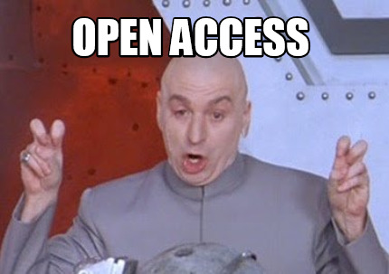
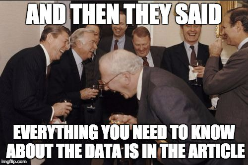
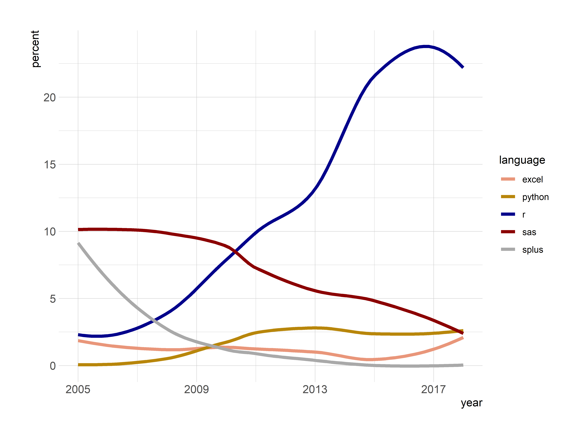
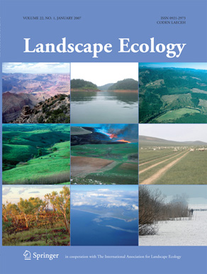
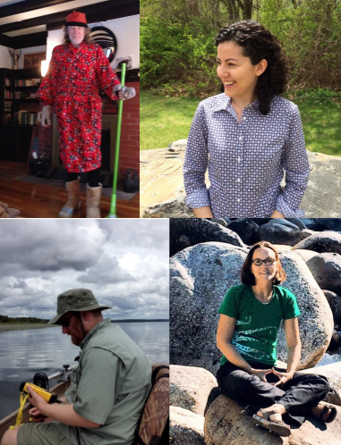

class: title-slide   

```{r setup, include=FALSE, message=FALSE}
options(htmltools.dir.version = FALSE)
#library(mapview)
#library(lakemorpho)
#library(elevatr)
#data(lake)
#data(pt_df)
```

# Lakes, Landscapes, and R:
## A framework for open science on freshwater cyanobacteria
</br>
</br>
</br>
### Jeff Hollister
</br>
#### Providence College
#### 2020-04-28

---
class: center, middle, inverse

# Twitter and Photos?

[](https://giphy.com/gifs/reaction-R459x856IfF6w)

### \#rspatial \#rstats \#cyanobacteria 
### @jhollist

---
class: center, middle, inverse

# Open Science?

---

# What is open science? 

- Access to materials     
- Reproducible/ Repeatable    
- A process, not a state                       

<a href="https://www.flickr.com/photos/lofink/4344960203"></img></a>

---
# Open Science Solutions

- Open Access
- <span style="color: lightgrey;">Open Data</span>
- <span style="color: lightgrey;">Open Source Code</span>

.center[[](https://memecreator.org/meme/open-access)]

---
# Open Science Solutions

- <span style="color: lightgrey;">Open Access</span>
- Open Data
- <span style="color: lightgrey;">Open Source Code</span>

.center[[](https://blogs.uoregon.edu/datamanagement/2017/02/14/lydweek-2017-2/)]

---
# Open Science Solutions

- <span style="color: lightgrey;">Open Access</span>
- <span style="color: lightgrey;">Open Data</span>
- Open Source Code

.center[[](https://rforcats.net)]

---
# R and Landscape Ecology

```{r r_lang,echo=FALSE, include=FALSE, warning=FALSE, message=FALSE}
library(rvest)
library(dplyr)
library(stringr)
library(purrr)
library(tidyr)
library(hrbrthemes)
library(ggplot2)
library(readr)
ggp <- read_csv("le_lang_year.csv") %>%
  filter(year > 2004) %>%
  gather(language, cites, r:excel) %>%
  mutate(percent = round(cites/num_articles*100, 2)) %>%
  ggplot(aes(x = year, y = percent, color = language)) +
  #geom_point() +
  geom_smooth(se = FALSE, size = 1.5) +
  theme_ipsum_rc(base_size = 11, axis_title_size = 11) +
  scale_color_manual(values = c("darksalmon","darkgoldenrod","darkblue",
                                "darkred","darkgrey")) +
  scale_x_continuous(labels = seq(2005,2020,by=4),
                       breaks = seq(2005,2020,by=4)) +
  scale_y_continuous(labels = seq(0, 30, by = 5),
                     breaks = seq(0,30,by=5))
  labs(y = "percent of articles")
ggsave(plot = ggp, filename = "figure/r_lang.png", width = 8, height = 6, units = "in",
       dpi = 600)
```

.center[<a href="https://github.com/jhollist/lakes_landscapes_r/blob/master/le_r_cites.R"></img></a>]

.footnote[Text mining facilitated by [rOpenSci's](https://ropensci.org) awesome [`fulltext`](https://CRAN.R-project.org/package=fulltext) package]

---
# R, Spatial Data, and Landscape Ecology: Foundations

.left-column[

- 2003 - 2016/Present
  - [`sp`](https://CRAN.R-project.org/package=sp) 
  - [`rgdal`](https://CRAN.R-project.org/package=rgdal)
  - [`raster`](https://CRAN.R-project.org/package=raster)
  - [`rgeos`](https://CRAN.R-project.org/package=rgeos)
- 2016 - Present
  - [`sf`](https://CRAN.R-project.org/package=sf)
  - [`raster`](https://CRAN.R-project.org/package=raster)
- Present - Very Near Future
  - [`stars`](https://CRAN.R-project.org/package=stars)
  - [`terra`](https://CRAN.R-project.org/package=terra)
]

.right-column[

</img>
]

---
# R, Spatial Data, and Landscape Ecology: Supporting Packages (Missing many!)

.left-column[

- Visualization/Mapping
  - [`mapview`](https://CRAN.R-project.org/package=mapview) and [`leaflet`](https://CRAN.R-project.org/package=leaflet)
  - [`tmap`](https://CRAN.R-project.org/package=tmap)
  - [`ggplot2`](https://CRAN.R-project.org/package=ggplot2)
- Data and API Packages
  - [`FedData`](https://CRAN.R-project.org/package=FedData)
  - [`tidycensus`](https://CRAN.R-project.org/package=tidycensus)
  - [`spocc`](https://CRAN.R-project.org/package=spocc) 
  - [`opencage`](https://CRAN.R-project.org/package=opencage)
- Landscape Ecology 
  - [`landscapemetrics`](https://CRAN.R-project.org/package=landscapemetrics)
  - [`landsat`](https://CRAN.R-project.org/package=landsat)
  - [`SDMtools`](https://CRAN.R-project.org/package=SDMTools)
  - [`nlmr`](https://CRAN.R-project.org/package=NLMR)
  - [`landscapetools`](https://CRAN.R-project.org/package=landscapetools)

]

.right-column[
</img>
]

---
class: center, middle, inverse

# R, lakes, and cyanobacteria at USEPA 

---

# Who are we?

.left-column[
- Ecologists 
- 2 FTE
  - Myself
  - Betty Kreakie
- 1 Post-doc
  - Stephen Shivers
- 1 Research associate
  - Sophie Fournier
- Alums
  - Bryan Milstead
  - Farnaz Nojavan
]

.right-column[
</img>
]

---

# What do we do? 

- Apply computational approaches to understand water quality impacts in lakes
- Focus on cyanobacteria
- Multiple Scales
- Open Science
- Use R
    - Analysis
    - Sharing code
    - Solve common problems


---

# R to solve common problems

  - `lakemorpho`
  - `elevatr`
  - `goatscape` (in development)
  
<a href = "figure/computer GIF-source.gif"></img></a>
---

# `lakemorpho`

.footnote[Package URL: <https://cran.r-project.org/package=lakemorpho>]

.left-column[
- Lake morphometry metrics in R
- `sp`, `rgdal`, `rgeos`, and `raster`
- `sf` support to be added
- [National Lake Morphometry](https://edg.epa.gov/metadata/catalog/search/resource/details.page?uuid=%7B495CBAED-9BB9-49B4-80A7-1C91DE5FCA95%7D)
- [NHD Plus](https://s3.amazonaws.com/nhdplus/NHDPlusV21/Documentation/NHDPlusV2_User_Guide.pdf#page=52)
- [Hollister and Milstead (2010)](http://dx.doi.org/10.1080/07438141.2010.504321)
- [Hollister *et. al.* (2011)](http://dx.doi.org/10.1371/journal.pone.0025764)
- [Hollister and Stachelek (2017)](https://f1000research.com/articles/6-1718/v1)
]

.right-column[
<!---->
</img>
]
---

# `elevatr`

.footnote[Package URL: <https://cran.r-project.org/package=elevatr>]

.left-column[
- Access elevation data in R
  - ~~Mapzen~~
      - closed!
  - AWS
  - USGS
- Built off of `sp`, `rgdal`, `rgeos`, and `raster` suite
- `sf` support to be added
- Incorporate <https://www.nextzen.org/>

]

.right-column[
<!---->
</img>
]

---

# Thanks!

.center[
**Jeff Hollister**</br>
US EPA </br>
Atlantic Ecology Division </br>
Narragansett, RI </br>
email: [hollister.jeff@epa.gov](mailto:hollister.jeff@epa.gov) </br>
twitter: [@jhollist](https://twitter.com/jhollist) </br>
github: [jhollist](https://github.com/jhollist) </br>
]


.footnote[
**Package acknowledgements**
- Slides created with [`xaringan`](https://cran.r-project.org/package=xaringan) 
- Figures created with [`ggplot2`](https://cran.r-project.org/package=ggplot2) and [`hrbrthemes`](https://cran.r-project.org/package=hrbrthemes)
- Data analysis made **MUCH** easier with the [`tidyverse`](https://cran.r-project.org/package=tidyverse)
- Text mining of Landscape Ecology done with [`fulltext`](https://cran.r-project.org/package=fulltext) and [`rcrossref`](https://cran.r-project.org/package=rcrossref)

**Slides and Source Code**
- Slides: <https://jhollist.github.io/pc_rspatial>
- Repo: <https://github.com/jhollist/pc_rspatial>
]
